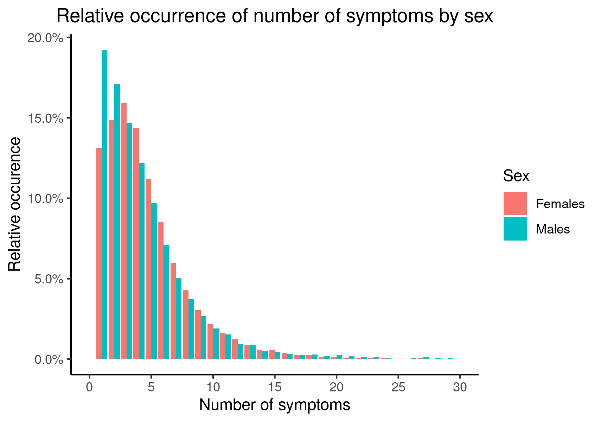
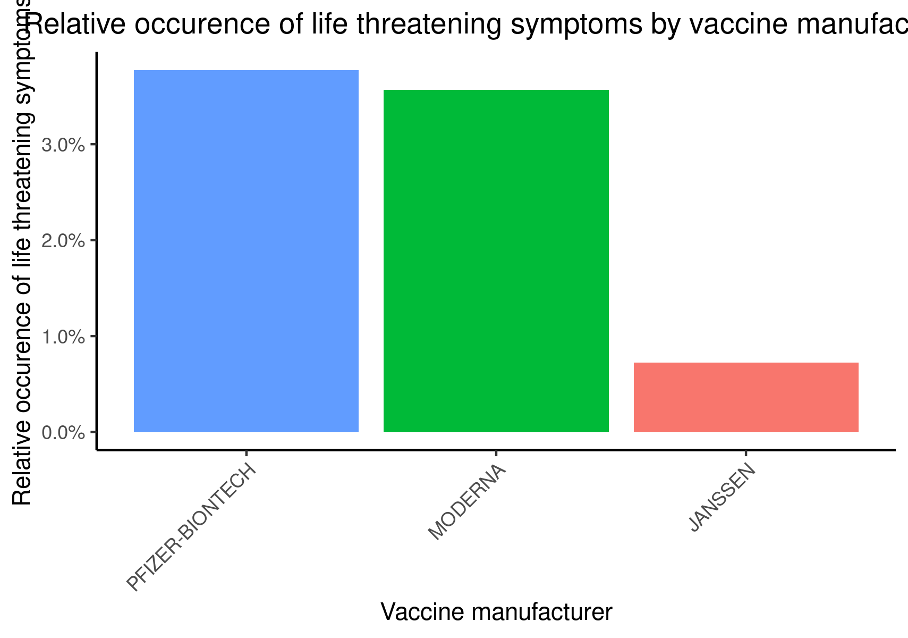
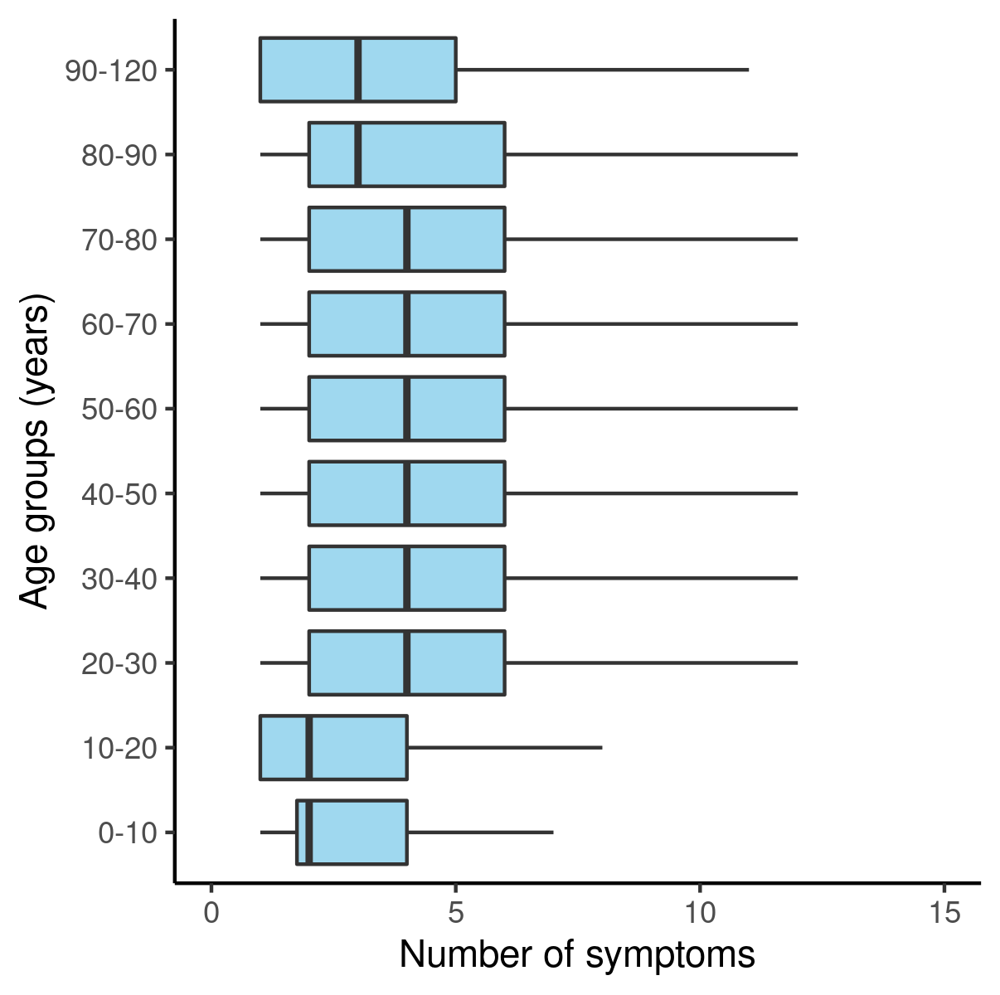
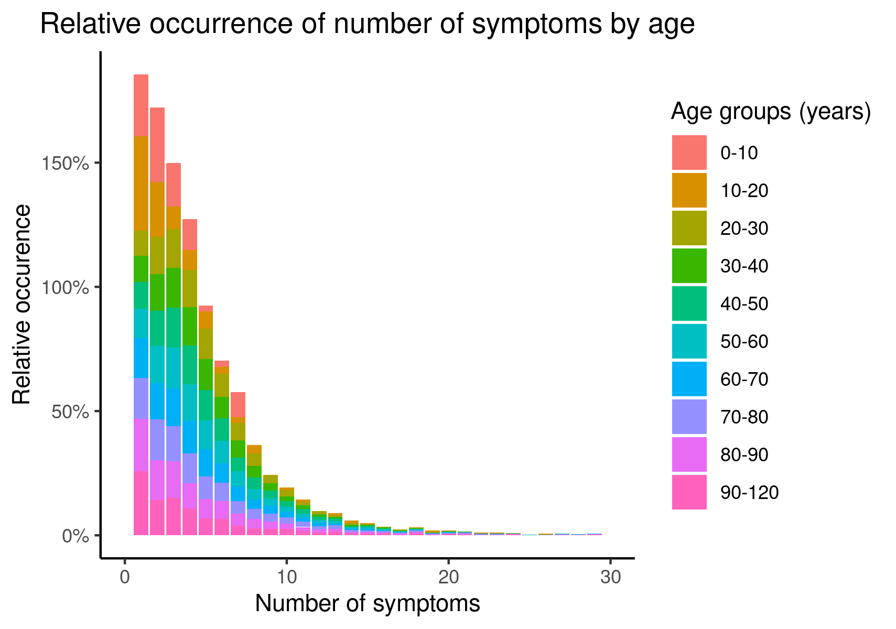
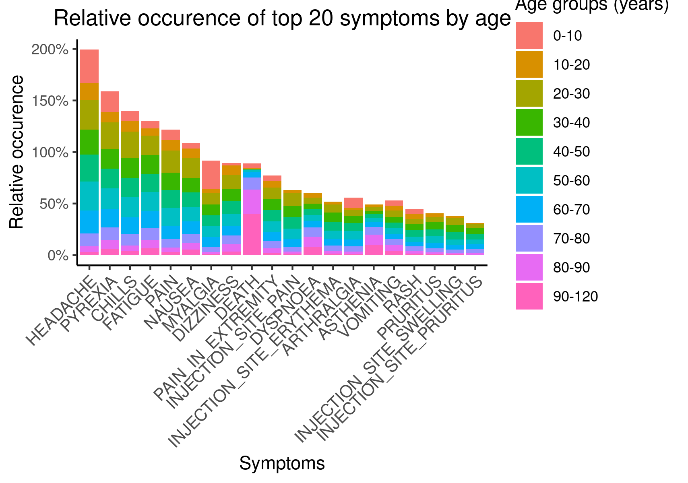
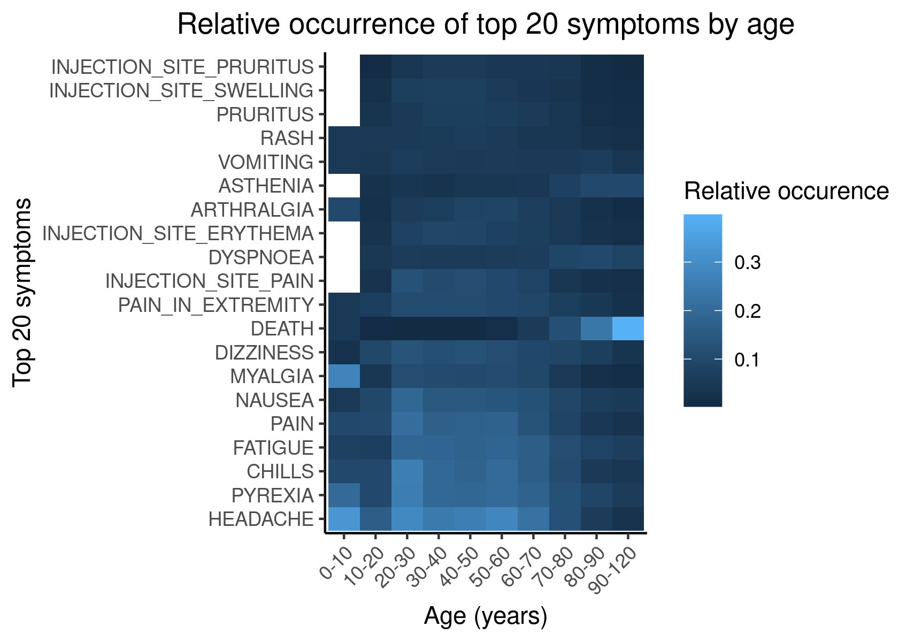

```{r include=FALSE}
library(tidyverse)
library(knitr)
```


## Overview of presentation
1. Introduction to COVID-19 World Vaccine Adverse Reactions Dataset
2. Project work flow
3. Challenges and solutions - Load, Clean and Augment
4. Data analysis
5. Conclusion and discussion


## COVID-19 World Vaccine Adverse Reactions
- Found on Kaggle (https://www.kaggle.com/ayushggarg/covid19-vaccine-adverse-reactions?select=2021VAERSSYMPTOMS.csv)
- Data from the Vaccine Adverse Event Reporting System (VAERS) created by the Food and Drug Administration (FDA) and Centers for Disease Control and Prevention (CDC) 
- Contains 3 data sets: 
    1. PATIENTS.CSV
    2. VACCINES.CSV
    3. SYMPTOMS.CSV
- Data sets connected by individual IDs (VAERS_ID)
- VAERS User Guide (https://vaers.hhs.gov/docs/VAERSDataUseGuide_November2020.pdf)
  - A guide to variable names

```{r message=TRUE, warning=TRUE, include=FALSE}
patients <- read_csv(file = gzfile("../data/01_patients.csv.gz"), 
                     col_types = cols("BIRTH_DEFECT" = col_character(),
                                      "X_STAY" = col_character(),
                                      "RPT_DATE" = col_date(format="%Y-%m-%d"),
                                      "V_FUNDBY" = col_character(),
                                      "ER_VISIT" = col_character()))

symptoms <- read_csv(file = gzfile("../data/01_symptoms.csv.gz"))

vaccines <- read_csv(file = gzfile("../data/01_vaccines.csv.gz"),
                     col_types = cols("VAX_DOSE_SERIES" = col_character()))
```


## COVID-19 World Vaccine Adverse Reactions
PATIENTS.CSV: Contains information about the individuals that received the vaccines

```{r echo=FALSE}
head(patients, 3)
```


## COVID-19 World Vaccine Adverse Reactions
VACCINES.CSV: Contains information about the received vaccine

```{r echo=FALSE}
vaccines %>% head(., 3)
```


## COVID-19 World Vaccine Adverse Reactions
SYMPTOMS.CSV: Contains information about the symptoms experiences after vaccination

```{r echo=FALSE}
head(symptoms, 3)
```


## Project workflow

```{r pressure, echo = FALSE, out.width = "75%"}
include_graphics("../doc/workflow.jpeg")
```


## 01_load - Challenges and Solutions


## 02_clean - Challenges and Solutions


## 03_augment - Challenges and Solutions


## 04_analysis - sex vs. number of symptoms

```{r nsymptoms_v_sex, echo = FALSE, out.width = "450px", out.height= "450px"}

```


## 04_analysis - sex vs. types of symptoms

```{r symptom_types_v_sex, echo = FALSE, out.width = "450px", out.height= "450px"}
include_graphics("../results/symptom_types_v_sex.png")
```


## 04_analysis - vaccine manufacturer vs. number of symptoms

```{r nsymptoms_v_manu, echo = FALSE, out.width = "450px", out.height= "450px"}
include_graphics("../results/nsymptoms_v_manu.png")
```


## 04_analysis - vaccine manufacturer vs. types of symptoms 

```{r symptom_types_v_manu, echo = FALSE, out.width = "450px", out.height= "450px"}
include_graphics("../results/symptom_types_v_manu.png")
```


## 04_analysis - vaccine manufacturer vs. life threatening symptoms

```{r manu_v_lthreat, echo = FALSE, out.width = "450px", out.height= "450px"}

```


## 04_analysis - age vs. number of symptoms (boxplot)

```{r age_v_nsymptoms_boxplot, echo = FALSE, out.width = "450px", out.height= "450px"}

```


## 04_analysis - age vs. number of symptoms (stacked barplot)

```{r age_v_nsymptoms_stacked, echo = FALSE, out.width = "450px", out.height= "450px"}

```


## 04_analysis - age vs. types of symptoms (stacked barplot)

```{r age_vs_symptom_types_stacked, echo = FALSE, out.width = "450px", out.height= "450px"}

```


## 04_analysis - age vs. types of symptoms (heatmap)

```{r age_vs_symptom_types_heatmap, echo = FALSE, out.width = "450px", out.height= "450px"}

```


## Conclusion and discussion


