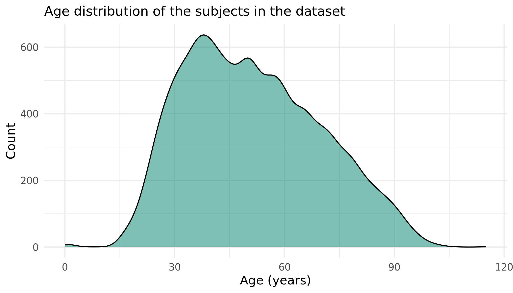
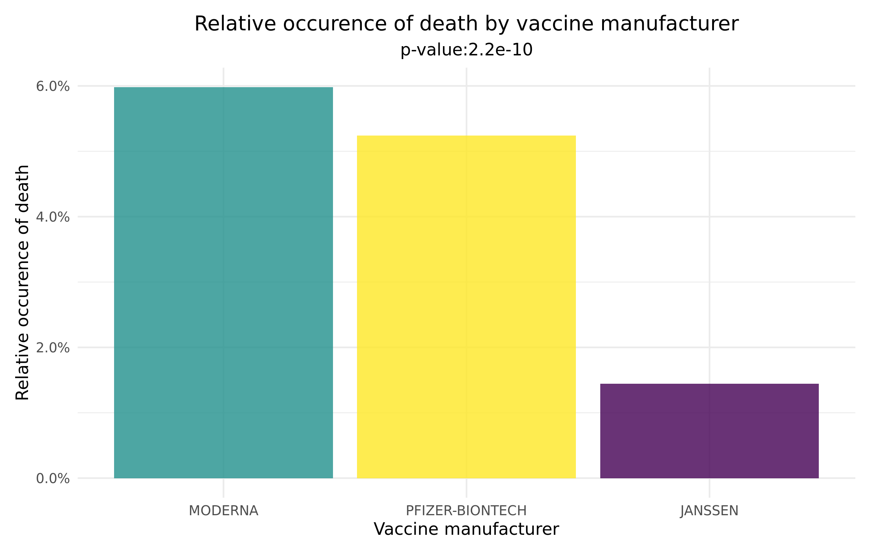

```{r include=FALSE}
library(tidyverse)
library(knitr)
```


## Overview of presentation
1. Introduction to COVID-19 World Vaccine Adverse Reactions Dataset
2. Project work flow
3. Challenges, solutions and tools used - Load, Clean and Augment
4. Data analysis
5. Conclusion and discussion


# COVID-19 World Vaccine Adverse Reactions


## COVID-19 World Vaccine Adverse Reactions
- Found on Kaggle (https://www.kaggle.com/ayushggarg/covid19-vaccine-adverse-reactions?select=2021VAERSSYMPTOMS.csv)
- Data from the Vaccine Adverse Event Reporting System (VAERS) created by the Food and Drug Administration (FDA) and Centers for Disease Control and Prevention (CDC) 
- Contains 3 data sets: 
    1. PATIENTS.CSV
    2. VACCINES.CSV
    3. SYMPTOMS.CSV
- Data sets connected by individual IDs (VAERS_ID)
- VAERS User Guide (https://vaers.hhs.gov/docs/VAERSDataUseGuide_November2020.pdf)
  - A guide to variable names

```{r message=TRUE, warning=TRUE, include=FALSE}
patients <- read_csv(file = gzfile("../data/01_patients.csv.gz"), 
                     col_types = cols("BIRTH_DEFECT" = col_character(),
                                      "X_STAY" = col_character(),
                                      "RPT_DATE" = col_date(format="%Y-%m-%d"),
                                      "V_FUNDBY" = col_character(),
                                      "ER_VISIT" = col_character()))

symptoms <- read_csv(file = gzfile("../data/01_symptoms.csv.gz"))

vaccines <- read_csv(file = gzfile("../data/01_vaccines.csv.gz"),
                     col_types = cols("VAX_DOSE_SERIES" = col_character()))
```


## COVID-19 World Vaccine Adverse Reactions
**PATIENTS.CSV**: Contains information about the individuals that received the vaccines

```{r echo=FALSE}
head(patients, 3)
```


## COVID-19 World Vaccine Adverse Reactions
**VACCINES.CSV**: Contains information about the received vaccine

```{r echo=FALSE}
vaccines %>% head(., 3)
```


## COVID-19 World Vaccine Adverse Reactions
**SYMPTOMS.CSV**: Contains information about the symptoms experiences after vaccination

```{r echo=FALSE}
head(symptoms, 3)
```


## Project workflow

```{r pressure, echo = FALSE, out.width = "75%"}
include_graphics("../doc/workflow.jpeg")
```


# 01_load

## 01_load - Important tools used
Important verbs and tools used to solve challenges:

- readr: read_csv(), write_csv()
- always saving files gzipped
- dealing with string NAs (include here?)
- specifying column types (include here?)


## 01_load - Challenges and Solutions 1

**CHALLENGE:** Multiple large files

**SOLUTION:** Keep them compressed and only decompress when reading into R:

```{r message=FALSE, warning=FALSE, include=TRUE, eval = FALSE}
# Read
patients <- read_csv(file = gzfile("../data/01_patients.csv.gz"))

# Clean
patients_clean <- patients %>% ...

# Write
write_csv(x = patients, file = "../data/02_patients_clean.csv.gz")
```


## 01_load - Challenges and Solutions 2

**CHALLENGE:** Wrong column types automatically assigned by R

```{r message=FALSE, warning=TRUE, include=TRUE}
patients <- read_csv(file = gzfile("../data/01_patients.csv.gz"))
```

**SOLUTION:** Manually assign column types

```{r message=FALSE, warning=FALSE, include=TRUE}
patients <- read_csv(file = gzfile("../data/01_patients.csv.gz"), 
                     col_types = cols("BIRTH_DEFECT" = col_character(),
                                      "X_STAY" = col_character(),
                                      "RPT_DATE" = col_date(format="%Y-%m-%d"),
                                      "V_FUNDBY" = col_character(),
                                      "ER_VISIT" = col_character()))
```


## 01_load - Challenges and Solutions 3

**CHALLENGE:** NA strings ("NA", "N/A", "Unknown", " "...)

**SOLUTION:** 

```{r message=FALSE, warning=FALSE, include=TRUE}
patients <- read_csv(file = gzfile("../data/01_patients.csv.gz"),
                     na = c("", " ", 
                                "NA", "N/A", "na", "Na", "n/a", "N/a", 
                                "None", "none", "None.", "NONE",
                                "unknown", "Unknown", "UNKNOWN", "U",
                                "NO KNOWN", "no known", "No known", "No Known", 
                                "None known", "none known", "NONE KNOWN", "None Known", 
                                "None reported", "Not applicable",
                                "No", "NO", "no"))
```


# 02_clean

## 02_clean - Important tools used
Important verbs and tools used to solve challenges:

- dplyr: filter(), select(), distinct(), mutate()
- tidyr: replace_na()


## 02_clean - Challenges and Solutions 1

I am aware of how horrible this table is :/


| CHALLENGE                                                        | SOLUTION                                              |
| ---------------------------------------------------------------- | ----------------------------------------------------- |
| Unwanted columns                                                 | `select(-c())`                                        |
| NAs that should be interpreted as "no"                           | `replace_na()`                                        |
| Row duplications                                                 | `distinct()`                                          |
| Individuals who got more than one vaccine type (generates noise) | `add_count(VAERS_ID) %>% filter(n==1) %>% select(-n)` |


# 03_augment

## 03_augment - Important tools used
Important verbs and tools used to solve challenges:

- dplyr: filter(), select(), mutate(), case_when(), arrange(), group_by(), count(), distinct(), summarise(), drop_na(), rename()
- tidyr: pivot_longer(), pivot_wider(), inner_join(), full_join(), pluck() 
- stringr: regular expressions, str_c(), str_replace(), str_replace()
- Anything else?


## 03_augment - Challenges and Solutions 1
**CHALLENGE:** Some columns contain long string descriptions that need to be turned into something tidy

**SOLUTION:** Make categorical variable


## 03_augment - Challenges and Solutions 1
**Example:** ALLERGIES column:
``` {r message=TRUE, warning=FALSE, include=FALSE}
patients %>%
  select(VAERS_ID, ALLERGIES) %>%
  head(6)
```

Make categorical variable that states if patient has allergies or not:
``` {r message=FALSE, warning=FALSE, include=TRUE, eval = FALSE}
patients %>%
  mutate(HAS_ALLERGIES = case_when(grepl("^no.?$ | ^no | ^none | ^not | ^non", 
                                         ALLERGIES, 
                                         ignore.case = TRUE) ~ "N",
                                 is.na(ALLERGIES) ~ "N",
                                 TRUE ~ "Y"))
```

Clean categorical HAS_ALLERGIES column:
``` {r echo = FALSE}
patients %>%
  mutate(HAS_ALLERGIES = case_when(grepl("^no.?$|^no |^none|^not|^non", 
                                         ALLERGIES, 
                                         ignore.case = TRUE) ~ 'N',
                                 is.na(ALLERGIES) ~ 'N',
                                 TRUE ~ 'Y')) %>%
  select(VAERS_ID, ALLERGIES, HAS_ALLERGIES) %>%
  filter(VAERS_ID == '0916603' | 
           VAERS_ID == '0916660' |
           VAERS_ID == '0916604' | 
           VAERS_ID == '0916685' | 
           VAERS_ID == '0917437' )
```


## 03_augment - Challenges and Solutions 1
**Another example:** OTHER_MEDS column

Detect individuals that have taken anti-inflammatory or steroid drugs before vaccine (not recommended):

``` {r message=FALSE, warning=FALSE, include=TRUE, eval = FALSE}
patients %>%
  mutate(TAKES_ANTIINFLAMATORY = 
           case_when(grepl("ibuprofen | aspirin | celecoxib | diclofenac | diflunisal | etodolac | indomethacin", 
                           OTHER_MEDS, 
                           ignore.case = TRUE) ~ "Y",
                     TRUE ~ "N")) %>% 
  mutate(TAKES_STEROIDS = 
           case_when(grepl("steroid | betamethasone | prednisolone | dexamethasone | hydrocortisone", 
                           OTHER_MEDS, 
                           ignore.case = TRUE) ~ "Y",
                     TRUE ~ "N"))
```


Clean, categorial TAKES_ANTIINFLAMMATORY and TAKES_STEROID columns:
``` {r echo = FALSE}
patients %>%
  mutate(TAKES_ANTIINFLAMATORY = case_when(grepl("ibuprofen|aspirin|celecoxib|diclofenac|diflunisal|etodolac|indomethacin", 
                                                 OTHER_MEDS, 
                                                 ignore.case = TRUE) ~ 'Y',
                                           TRUE ~ 'N')) %>% 
  mutate(TAKES_STEROIDS = case_when(grepl("steroid|betamethasone|prednisone|dexamethasone|hydrocortisone", 
                                          OTHER_MEDS, 
                                          ignore.case = TRUE) ~ 'Y',
                                    TRUE ~ 'N')) %>%
  select(VAERS_ID, OTHER_MEDS, TAKES_ANTIINFLAMATORY, TAKES_STEROIDS) %>%
  filter(VAERS_ID == "0921732" | VAERS_ID == "0918421" | VAERS_ID == "0934539" | VAERS_ID == "0932980")
```


## 03_augment - Challenges and Solutions 2

**CHALLENGE:** Symptoms are recorded in a way that makes later analysis difficult

``` {r echo=FALSE}
symptoms %>%
  select(VAERS_ID, SYMPTOM1, SYMPTOM2, SYMPTOM3, SYMPTOM4, SYMPTOM5) %>%
  slice(20:24)
```

**SOLUTION:** 20 most common symptoms are found and turned into TRUE/FALSE columns

``` {r message=FALSE, warning=FALSE, echo=FALSE}
merged_data_wide <- read_csv(file = gzfile("../data/03_merged_data_wide.csv.gz"))
merged_data_wide %>%
  select(VAERS_ID, HEADACHE, PYREXIA, CHILLS, FATIGUE, PAIN, PAIN_IN_EXTREMITY, NAUSEA, DIZZINESS, MYALGIA, INJECTION_SITE_ERYTHEMA, INJECTION_SITE_PRURITUS, INJECTION_SITE_SWELLING, INJECTION_SITE_PAIN, ARTHRALGIA, DYSPNOEA, VOMITING, PRURITUS, DEATH, RASH, ASTHENIA) %>%
  head(3)
```


# 04_analysis_visualizations

## 04_analysis_visualizations - Important tools used
Important verbs and tools used:

- ggplot()
- geom_bar(), geom_boxplot(), geom_tile(), geom_segment()
- scales()
- fct_reorder()
- patchwork package
- viridis package


## 04_analysis_visualizations - Age, sex and vaccine manufacturer distribution

## 04_analysis_visualizations - Age distribution

## 04_analysis_visualizations - Age manufacturer distribution


```{r age_dist, echo = FALSE, out.width = "600px", out.height= "450px"}


```

## 04_analysis_visualizations - Sex and vaccine manufacturer distribution

Table: Sex distribution

|SEX |     n|
|:---|-----:|
|F   | 24070|
|M   |  8514|
|NA  |   828|

Table: Vaccine manufacturer distribution

|VAX_MANU        |     n|
|:---------------|-----:|
|JANSSEN         |  1106|
|MODERNA         | 16253|
|PFIZER-BIONTECH | 16053|

## 04_analysis_visualizations - Days until onset of symptoms vs. Age Group

```{r symptoms_after_v_agegroup, echo = FALSE, out.width = "600px", out.height= "450px"}
include_graphics("../results/symptoms_after_v_agegroup.png")

```


## 04_analysis_visualizations - Age/sex vs. number of symptoms

```{r nsymptoms_age_sex, echo = FALSE, out.width = "800px", out.height= "350px"}
include_graphics("../results/nsymptoms_age_sex.png")
```


## 04_analysis_visualizations - Vaccine manufacturer vs. number of symptoms

```{r nsymptoms_v_manu, echo = FALSE, out.width = "650px", out.height= "400px"}
include_graphics("../results/nsymptoms_v_manu.png")
```


## 04_analysis_visualizations - Age vs. types of symptoms

```{r symptom_types_v_age, echo = FALSE, out.width = "550px", out.height= "450px"}
include_graphics("../results/symptom_types_v_age.png")
```


## 04_analysis_visualizations - Sex vs. types of symptoms

```{r symptom_types_v_sex, echo = FALSE, out.width = "750px", out.height= "400px"}
include_graphics("../results/symptom_types_v_sex.png")
```


## 04_analysis_visualizations - Vaccine manufacturer vs. types of symptoms

```{r symptom_types_v_manu, echo = FALSE, out.width = "875px", out.height= "455px"}
include_graphics("../results/symptom_types_v_manu.png")
```


## 04_analysis_visualizations - vaccine manufacturer vs. death

```{r manu_v_death, echo = FALSE, out.width = "600px", out.height= "400px"}

```


# 04_analysis_regressions

## 04_analysis_regressions - Important tools used
Important verbs and tools used:

- glm()
- broom: tidy(), glance()


## 04_analysis_modeling - logistic model of death vs. top 20 symptoms

```{r eval=FALSE, echo=TRUE, results = "hide", error=FALSE, message=FALSE, warning=FALSE, results = 'hide'}
death_v_symptoms_model <- merged_data_wide %>%
  glm(data = ., 
      formula = str_c("DEATH ~ ", str_c(symptoms, collapse = "+")), 
      family = binomial)
```


# 04_analysis_tests 

## 04_analysis_tests - Important tools used
Important verbs and tools used:

- prop_test()
- chisq.test()


# 04_analysis_clustering

## 04_analysis_clustering - Important tools used
Important verbs and tools used:

- prcomp()
- kmeans()
- tidymodels: (used for what?)


## 04_analysis_clustering - PCA biplot

```{r biplot, echo = FALSE, out.width = "695px", out.height= "340px"}
include_graphics("../results/biplot.png")
```

## 04_analysis_clustering - Rotation matrix

```{r rotation_matrix, echo = FALSE, out.width = "695px", out.height= "340px"}
include_graphics("../results/rotation_matrix.png")
```

## 04_analysis_clustering - Scree plot

```{r scree_plot, echo = FALSE, out.width = "695px", out.height= "340px"}
include_graphics("../results/scree_plot.png")
```


## Conclusion and discussion


