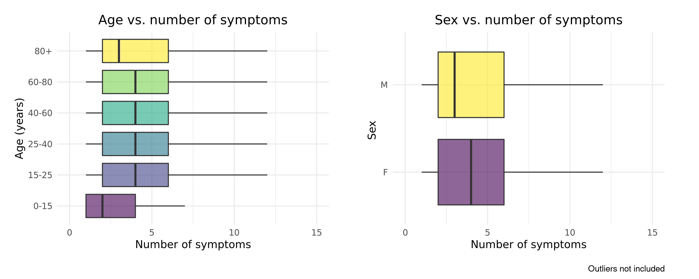

```{r setup, include=FALSE}
knitr::opts_chunk$set(echo = FALSE)
```

```{r include=FALSE}
library(tidyverse)
library(knitr)
```


## Project Outline

1. Introduction

2. Materials and methods

3. Results and discussion

    3.1. Exploratory data analysis
  
    3.2. Modeling
  
4. Conclusion


# Introduction

## Introduction: Dataset | COVID-19 World Vaccine Adverse Reactions

- Data from the Vaccine Adverse Event Reporting System (VAERS) created by the Food and Drug Administration (FDA) and Centers for Disease Control and Prevention (CDC) 
- Contains 3 datasets: 
    1. PATIENTS.CSV
    2. VACCINES.CSV
    3. SYMPTOMS.CSV
- Datasets connected by patient IDs (VAERS_ID)

```{r message=TRUE, warning=TRUE, include=FALSE}
patients <- read_csv(file = gzfile("../data/01_patients.csv.gz"), 
                     col_types = cols("BIRTH_DEFECT" = col_character(),
                                      "X_STAY" = col_character(),
                                      "RPT_DATE" = col_date(format="%Y-%m-%d"),
                                      "V_FUNDBY" = col_character(),
                                      "ER_VISIT" = col_character()))

symptoms <- read_csv(file = gzfile("../data/01_symptoms.csv.gz"))

vaccines <- read_csv(file = gzfile("../data/01_vaccines.csv.gz"),
                     col_types = cols("VAX_DOSE_SERIES" = col_character()))
```


## Introduction: Dataset | COVID-19 World Vaccine Adverse Reactions

**PATIENTS.CSV**: Contains information about the individuals that received the vaccines

```{r echo=FALSE}
patients %>%
  print(n=3)
```


## Introduction: Dataset | COVID-19 World Vaccine Adverse Reactions

**VACCINES.CSV**: Contains information about the received vaccine

```{r echo=FALSE}
vaccines %>% 
  print(head = 5) 
```


## Introduction: Dataset | COVID-19 World Vaccine Adverse Reactions
 
**SYMPTOMS.CSV**: Contains information about the symptoms experienced after vaccination

```{r echo=FALSE}
symptoms %>%
  print(n = 6)
```


## Introduction: Aim
The aim of this project is to gain insight on the adverse effects of different Covid-19 vaccines and answer questions such as:

- Do some vaccines cause more/different symptoms than others?

- Do patients with some profiles get more/different symptoms?

- Are certain symptoms correlated with death?

- Is patient profile correlated with death?

- Does taking anti-inflammatory drugs reduce the chance of having symptoms?


# Methods

## Methods: Project workflow

```{r workflow, echo = FALSE, out.width = "100%", out.extra = 'style = "float:right; padding:10px"', fig.align = "center"}

```

## Methods: Challenges and solutions 

### Cleaning

- **NAs** that should be interpreted as "no" &rightarrow; **replace_na**(ALLERGIES = "N") 
- **Duplicated IDs** &rightarrow; **add_count**(VAERS_ID) **%>% filter**(n == 1) **%>% select**(-n)

### Augment

- Columns containing **long string descriptions** &rightarrow; Make **tidy categorical (Y/N) variables** 

```{r, echo= FALSE, warning=FALSE, message=FALSE}
clean <- read_csv(gzfile("../data/02_patients_clean.csv.gz"))
aug <- read_csv(gzfile("../data/03_patients_clean_aug.csv.gz"))
clean %>%
  inner_join(aug, by = "VAERS_ID") %>%
  select(VAERS_ID, OTHER_MEDS, TAKES_ANTIINFLAMATORY) %>%
  filter(VAERS_ID == '0916988'|
           VAERS_ID == '0916983'|
           VAERS_ID == '0916996')
```

- **Too many symptoms** and untidy &rightarrow; extract **top 20 occurring symptoms** and turn them into **tidy categorical (TRUE/FALSE) columns**


# Results and Discussion

# Exploratory Data Analysis | Visualization

## Visualization | Group representation: Age, sex and manufacturer

```{r age_dist, echo = FALSE, out.width = "60%", out.height = "350px", fig.show='hold', out.extra='style = "float:right;padding:10px"'}
include_graphics("../results/age_dist.png")

```

```{r message=FALSE, warning=FALSE, echo=FALSE}
merged_data_wide <- read_csv(gzfile("../data/03_merged_data_wide.csv.gz"))
merged_data_wide %>% 
  count (SEX) 

merged_data_wide %>% 
  count (VAX_MANU)
  
```


## Visualization | When do symptoms appear?

```{r symptoms_after_v_agegroup, echo = FALSE, out.width = "750px", out.height= "350px", fig.align = "center"}
include_graphics("../results/symptoms_after_dist_age.png")

```

Hypothesis: two peaks corresponding to the innate and acquired immune response. Stronger innate response in younger individuals.


## Visualization | Does age/sex impact the number of symptoms?

```{r nsymptoms_age_sex, echo = FALSE, out.width = "800px", out.height= "350px", fig.align = "center"}

```

Observations: no noticeable differences


## Visualization | Does vaccine type impact the number of symptoms?

```{r nsymptoms_v_manu, echo = FALSE, out.width = "650px", out.height= "400px", fig.align = "center"}
include_graphics("../results/nsymptoms_v_manu.png")
```

Observations: no noticeable differences


## Visualization | Do symptoms differ among age groups?

```{r symptom_types_v_age, echo = FALSE, out.width = "500px", out.height= "400px", fig.align = "center"}
include_graphics("../results/symptom_types_v_age.png")
```

Hypothesis: symptoms associated to a strong immune response are most common in younger groups. 


## Visualization | Do symptoms differ in males and females? 

```{r symptom_types_v_sex, echo = FALSE, out.width = "750px", out.height= "400px", fig.align = "center"}
include_graphics("../results/symptom_types_v_sex.png")
```

Observations: some noticeable differences, hereamongst death, more common in males.


## Visualization | Do different vaccines cause different symptoms?

```{r symptom_types_v_manu, echo = FALSE, out.width = "750px", out.height= "400px", fig.align = "center"}
include_graphics("../results/symptom_types_v_manu.png")
```

Observations: Janssen causes the most common symptoms more often (n.b. smaller sample size)


# Exploratory Data Analysis | Principal Component Analysis


## PCA | Do vaccine types cluster together? 

```{r, fig.align = "center", out.width = "700px", out.height= "400px"}
include_graphics("../results/pca_plot.png")
```

Observations: no observable clustering.


# Modelling | Logistic Regressions 


## Logistic Regression | Is the patient's profile correlated with death?

_glm(death ~ sex + age + allergic/not + ill/not + has/had covid/not, family = binomial)_

```{r death_v_profile_pval, echo = FALSE, out.width="50%", fig.show='hold'}
include_graphics(c("../results/death_v_profile_model_fig_pval.png", "../results/death_v_profile_model_fig_odds.png"))
```

Observations: Age, illness and being male are positively correlated with death (p-value < 0.05).


## Logistic Regression | Are some symptoms correlated with death?

_glm(death ~ symptoms, family = binomial)_

```{r, echo = FALSE, out.width="50%", fig.show='hold'}
include_graphics(c("../results/death_v_symptoms_model_fig_pval.png", "../results/death_v_symptoms_model_fig_odds.png"))
```

Observations: asthenia, dyspnoea and vomiting are positively correlated with death (p-value < 0.05). 


## Many Logistic Regressions | Do anti-inflammatory drugs reduce symptoms?

_glm(each symptom ~ takes anti-inflammatory/not , family = binomial)_


```{r symptoms_v_antiinfl_manhattan, echo = FALSE, out.width="50%", fig.show='hold'}
include_graphics(c("../results/symptoms_v_antiinflamatory_model_fig_manhattan.png", "../results/symptoms_v_antiinflamatory_model_fig_odds.png"))
```

Observations: no significant reduction in symptoms (p-value < 0.05). Possible increase?


# Modelling | Proportion tests

```{r echo = FALSE, include=FALSE}
contingency_table1 <- read_csv("/cloud/project/results/contingency_table1.csv")

contingency_table2 <- read_csv("/cloud/project/results/contingency_table2.csv")
```


## Proportion tests | Does the proportion of death differ amongst vaccine types? 

```{r echo=FALSE, fig.show='hold', out.width="45%", fig.show='hold', out.extra='style = "float:right;padding:10px"'}
include_graphics("/cloud/project/results/manu_v_death.png")
```

```{r echo=FALSE}
contingency_table1
```


Observations: there is a significant difference among vaccine types (p-value < 0.05).


## Proportion tests | Does the proportion of death differ between males and females?

```{r echo=FALSE, fig.show='hold', out.width="45%", fig.show='hold', out.extra='style = "float:right;padding:10px"'}
include_graphics("/cloud/project/results/sex_v_death.png")
```

```{r echo=FALSE}
contingency_table2
```

Observations: death is significantly more common in males (p-value < 0.05).

## Conclusion

Uneven group sizes difficults interpretation of results. Knowing this, we observed the following:

1. Most vaccine recipients experience symptoms immediately. 

2. Symptoms associated to the expected immune response happen more often in younger age groups.

3. Age, illness and being male are positively correlated with death. 

4. Asthenia, dyspnoea and vomiting are positively correlated with death.

5. Anti-inflammatory drugs do not reduce symptoms.

6. The proportion of death varies among vaccine types.

7. The proportion of death is higher in males. 


## References

Dataset: https://www.kaggle.com/ayushggarg/covid19-vaccine-adverse-reactions?select=2021VAERSSYMPTOMS.csv

Dataset user guide: https://vaers.hhs.gov/docs/VAERSDataUseGuide_November2020.pdf


