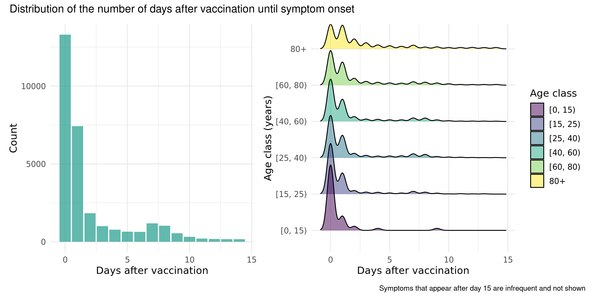

```{r setup, include=FALSE}
knitr::opts_chunk$set(echo = FALSE)
```

```{r include=FALSE}
library(tidyverse)
library(knitr)
```


## Overview of presentation
1. Introduction to COVID-19 World Vaccine Adverse Reactions Dataset
2. Project work flow
3. Project methods

    3.1 Overview of important packages and verbs used
    
    3.2 Challenges and solutions - Load, Clean and Augment
    
4. Visualizations
5. Modeling
6. Conclusion and discussion


# Introduction | COVID-19 World Vaccine Adverse Reactions


## Introduction | COVID-19 World Vaccine Adverse Reactions

- Found on Kaggle (https://www.kaggle.com/ayushggarg/covid19-vaccine-adverse-reactions?select=2021VAERSSYMPTOMS.csv)
- Data from the Vaccine Adverse Event Reporting System (VAERS) created by the Food and Drug Administration (FDA) and Centers for Disease Control and Prevention (CDC) 
- Contains 3 data sets: 
    1. PATIENTS.CSV
    2. VACCINES.CSV
    3. SYMPTOMS.CSV
- Data sets connected by individual IDs (VAERS_ID)
- VAERS User Guide (https://vaers.hhs.gov/docs/VAERSDataUseGuide_November2020.pdf)
  - A guide to variable names

```{r message=TRUE, warning=TRUE, include=FALSE}
patients <- read_csv(file = gzfile("../data/01_patients.csv.gz"), 
                     col_types = cols("BIRTH_DEFECT" = col_character(),
                                      "X_STAY" = col_character(),
                                      "RPT_DATE" = col_date(format="%Y-%m-%d"),
                                      "V_FUNDBY" = col_character(),
                                      "ER_VISIT" = col_character()))

symptoms <- read_csv(file = gzfile("../data/01_symptoms.csv.gz"))

vaccines <- read_csv(file = gzfile("../data/01_vaccines.csv.gz"),
                     col_types = cols("VAX_DOSE_SERIES" = col_character()))
```


## Introduction | COVID-19 World Vaccine Adverse Reactions

**PATIENTS.CSV**: Contains information about the individuals that received the vaccines

```{r echo=FALSE}
patients %>%
  head(3)
```

Dimensions:
```{r echo = TRUE}
dim(patients)
```


## Introduction | COVID-19 World Vaccine Adverse Reactions

**VACCINES.CSV**: Contains information about the received vaccine

```{r echo=FALSE}
vaccines %>% 
  head(3) 
```

Dimensions:
```{r echo=TRUE}
dim(vaccines)
```


## Introduction | COVID-19 World Vaccine Adverse Reactions

**SYMPTOMS.CSV**: Contains information about the symptoms experienced after vaccination

```{r echo=FALSE}
head(symptoms, 3)
```

Dimensions:
```{r echo=TRUE}
dim(symptoms)
```


## Methods: Project workflow

```{r workflow, echo = FALSE, out.width = "60%", out.extra = 'style = "float:right; padding:10px"'}
include_graphics("../doc/workflow.jpeg")
```

1. Load data sets (patients, vaccines, symptoms)
2. Clean each data set individually
3. Augment and merge the data sets
4. Make visualizations
5. Do modeling


## Methods: Important packages and verbs
<style>
.column-left{
  float: left;
  width: 30%;
  text-align: left;
  margin: 0 4%;
}

.column-center{
  display: inline-block;
  width: 30%;
  text-align: left;
}
.column-right{
  float: right;
  width: 30%;
  text-align: left;
}
</style>


<div class="column-left">
### Load and clean

- **readr**: read_csv(), write_csv()
- **dyplyr**: filter(), select(), distinct(), mutate()
- **tidyr**: replace_na()
</div>


<div class="column-center">
### Augment

  - **dplyr**: filter(), select(), mutate(), case_when(), arrange(), group_by(), count(), distinct(), summarise(), drop_na(), rename()
  - **tidyr**: pivot_longer(), pivot_wider(), inner_join(), full_join(), pluck() 
  - **stringr**: regular expressions, str_c(), str_replace(), str_replace()
</div>


<div class="column-right">
### Analysis

- **ggplot**: geom_bar(), geom_boxplot(), geom_tile(), geom_segment(), theme_minimal()
- **forcats**: fct_reorder()
- **scales**
- **patchwork**
- **viridis**
- **stats (?)**: glm(), prcomp()
- **broom**: tidy(), glance()
- **purrr**: map(), nest()
</div>


## Methods: Dataset loading | Challenges and solutions 

#### Patients, vaccines and symptoms datasets:

- Multiple **large files** &rightarrow; keep them compressed as **gz-files** and only decompress when reading into R
- Wrong **column types** automatically assigned by R &rightarrow; **manually assign** appropriate column types  
- **NA strings** ("NA", "N/A", "Unknown", " "...) &rightarrow; **assign NAs** when loading data


## Methods: Dataset cleaning | Challenges and solutions 

#### Patients dataset:

- Unwanted **dirty/uniformative columns** &rightarrow; **select(-c**(CAGE_YR, CAGE_MO, RPT_DATE ... ))
- **NAs** that should be interpreted as "no" &rightarrow; **replace_na**(ALLERGIES = "N") 
- Row **duplications** &rightarrow; **distinct()**

#### Vaccines dataset:

- Contains **non-COVID19** vaccines &rightarrow; **filter**(VAX_TYPE == "COVID19")
- Contains vaccines of **unknown manufacturer** &rightarrow; **filter**(VAX_MANU != "UNKNOWN MANUFACTURER")
- **Row duplications** &rightarrow; distinct() 
- **Duplicated IDs** &rightarrow; **add_count**(VAERS_ID) **%>% filter**(n == 1) **%>% select**(-n)
- **Inconsistent naming** of vaccines &rightarrow; **rename()**
- **Redundant and dirty** columns &rightarrow; **select(-c(**VAX_NAME, VAX_LOT))

#### Symptoms dataset:

- SYMPTOMVERSION1-5 columns are **unneccessary** &rightarrow; **select(-c())**


## Methods: Data augmentation | Challenges and solutions

#### Patients data set:

- Columns containing **long string descriptions** &rightarrow; Make **tidy categorical (Y/N) variables** 

```{r, echo= FALSE, warning=FALSE, message=FALSE}
clean <- read_csv(gzfile("../data/02_patients_clean.csv.gz"))
aug <- read_csv(gzfile("../data/03_patients_clean_aug.csv.gz"))
clean %>%
  inner_join(aug, by = "VAERS_ID") %>%
  select(VAERS_ID, OTHER_MEDS, TAKES_ANTIINFLAMATORY) %>%
  filter(VAERS_ID == '0916988'|
           VAERS_ID == '0916983'|
           VAERS_ID == '0916996')
```


- **Dirty, redundant and uninformative** columns &rightarrow; **select(-c**(ALLERGIES, OTHER_MEDS ... )) 

#### Symptoms data set:

- **Too many symptoms** and dirty &rightarrow; extract **top 20 occurring symptoms** and turn them into **tidy categorical (TRUE/FALSE) columns**
- Calculate **total number of symptoms** per patient &rightarrow; *mutate()* to add column (N_SYMPTOMS)


## Methods: Data augmentation | Merging datasets 

- For visualizing, we need the **wide format** &rightarrow; **inner_join**(by = VAERS_ID)
- For modelling, symptoms must be in **long-format** &rightarrow; **pivot_longer()** to create:
  - SYMPTOM column: top 20 symptom names
  - SYMPTOM_VALUE column: TRUE/FALSE


## Methods: Analysis
### Exploratory data analysis

- Visualizations with **ggplot()**
- Reduction of dimensionality (Principal Component Analysis) with **prcomp()**

### Modelling and statistics

- Logistic regression models with **glm()**
- Proportions tests with **chisq.test()**


# 04_analysis_visualizations

## 04_analysis_visualizations - Age, sex and manufacturer distribution


```{r age_dist, echo = FALSE, out.width = "500px", out.height = "300px", out.extra = 'style = "float:left;padding:20px"'}
include_graphics("../results/age_dist.png")

```

```{r message=FALSE, warning=FALSE, echo=FALSE, out.width="50%", out.extra='style = "float:right;padding:20px"'}
merged_data_wide <- read_csv(gzfile("../data/03_merged_data_wide.csv.gz"))
merged_data_wide %>% 
  count (SEX)

merged_data_wide %>% 
  count (VAX_MANU)
```


## 04_analysis_visualizations - Days until onset of symptoms vs. Age Group

Hypothesis: two peaks corresponding to the innate and acquired immune response

```{r symptoms_after_v_agegroup, echo = FALSE, out.width = "700px", out.height= "350px"}


```


## 04_analysis_visualizations - Age/sex vs. number of symptoms

```{r nsymptoms_age_sex, echo = FALSE, out.width = "800px", out.height= "350px"}
include_graphics("../results/nsymptoms_age_sex.png")
```


## 04_analysis_visualizations - Vaccine manufacturer vs. number of symptoms

```{r nsymptoms_v_manu, echo = FALSE, out.width = "650px", out.height= "400px"}
include_graphics("../results/nsymptoms_v_manu.png")
```


## 04_analysis_visualizations - Age vs. types of symptoms

```{r symptom_types_v_age, echo = FALSE, out.width = "550px", out.height= "450px"}
include_graphics("../results/symptom_types_v_age.png")
```


## 04_analysis_visualizations - Sex vs. types of symptoms

```{r symptom_types_v_sex, echo = FALSE, out.width = "750px", out.height= "400px"}
include_graphics("../results/symptom_types_v_sex.png")
```


## 04_analysis_visualizations - Vaccine manufacturer vs. types of symptoms

```{r symptom_types_v_manu, echo = FALSE, out.width = "875px", out.height= "455px"}
include_graphics("../results/symptom_types_v_manu.png")
```


# 04_analysis_regressions


## 04_analysis_modeling | Logistic regression: death ~ patient profile

```{r, eval = FALSE}
merged_data_wide %>%
  glm(formula = DIED ~ SEX + AGE_YRS + HAS_ALLERGIES + HAS_ILLNESS + HAS_COVID + HAD_COVID, 
      family = binomial) %>%
  tidy() %>%
  mutate(odds_ratio = exp(estimate))
```


```{r death_v_profile_model, eval=TRUE, echo=FALSE, error=FALSE, message=FALSE, warning=FALSE, tidy = TRUE}
model <- read_csv("../results/death_v_profile_model.csv")
model
```

## 04_analysis_modeling | Logistic regression: death ~ patient profile

```{r death_v_profile_pval, echo = FALSE, out.width="50%", fig.show='hold'}
include_graphics(c("../results/death_v_profile_model_fig_pval.png", "../results/death_v_profile_model_fig_odds.png"))
```


## 04_analysis_modeling | Logistic regression: death ~ symptoms

```{r, eval = FALSE}
merged_data_wide %>%
  glm(formula = str_c("DEATH ~ ", str_c(symptoms, collapse = "+")), 
      family = binomial) %>%
  tidy() %>%
  mutate(odds_ratio = exp(estimate))
```


```{r death_v_symptoms_model, eval=TRUE, echo=FALSE, error=FALSE, message=FALSE, warning=FALSE, tidy = TRUE}
model <- read_csv("../results/death_v_symptoms_model.csv")
model %>%
  print(n = 8)
```


## 04_analysis_modeling | Logistic regression: death ~ symptoms

```{r, echo = FALSE, out.width = "60%", out.extra = 'style = "float:right; padding:10px"'}
include_graphics(c("../results/death_v_symptoms_model_fig_pval.png", "../results/death_v_symptoms_model_fig_odds.png"))
```


## 04_analysis_modeling | Many logistic regressions: each symptom ~ takes anti-inflamatory

```{r, eval = FALSE}
merged_data_long %>%
  select(TAKES_ANTIINFLAMATORY, SYMPTOM, SYMPTOM_VALUE) %>%
  group_by(SYMPTOM) %>%
  nest %>% 
  ungroup %>%
  mutate(mdl = map(data, ~glm(TAKES_ANTIINFLAMATORY ~ SYMPTOM_VALUE,
                              family = binomial))) %>%
  mutate(mdl_tidy = map(mdl, ~tidy(.x, conf.int = TRUE)))
```


```{r symptoms_v_antiinfl_model, eval=TRUE, echo=FALSE, error=FALSE, message=FALSE, warning=FALSE}
model <- read_csv("../results/symptoms_v_antiinflamatory_model.csv")
model %>%
  select(-c(term, symptom_label, neg_log10_p)) %>%
  print(n = 5)
```


## 04_analysis_modeling | Many logistic regressions: each symptom ~ takes anti-inflamatory

```{r symptoms_v_antiinfl_manhattan, echo = FALSE, out.width="50%", fig.show='hold'}
include_graphics(c("../results/symptoms_v_antiinflamatory_model_fig_manhattan.png", "../results/symptoms_v_antiinflamatory_model_fig_odds.png"))
```


# 04_analysis_tests 

## 04_analysis_tests
Chi-squared contingency table tests

```{r echo = FALSE, include=FALSE}
contingency_table1 <- read_csv("/cloud/project/results/contingency_table1.csv")
contingency_table2 <- read_csv("/cloud/project/results/contingency_table2.csv")
```


```{r echo = FALSE}
kable(list(contingency_table1,contingency_table2))
```
```{r echo = FALSE, out.width="50%", fig.show='hold'}
include_graphics(c("/cloud/project/results/manu_v_death.png", "/cloud/project/results/sex_v_death.png"))
```

# 04_analysis_pca

## 04_analysis_pca - Important tools used
Important verbs and tools used:

- prcomp()
- augment ()

## 04_analysis_pca - PCA plot

```{r pca_plot, echo = FALSE, out.width = "695px", out.height= "400px"}

```

## 04_analysis_pca - Rotation matrix

```{r rotation_matrix, echo = FALSE, out.width = "640px", out.height= "500px"}
include_graphics("../results/rotation_matrix.png")
```

## 04_analysis_pca - Scree plot

```{r scree_plot, echo = FALSE, out.width = "695px", out.height= "340px"}
include_graphics("../results/scree_plot.png")
```


## Conclusion and discussion


