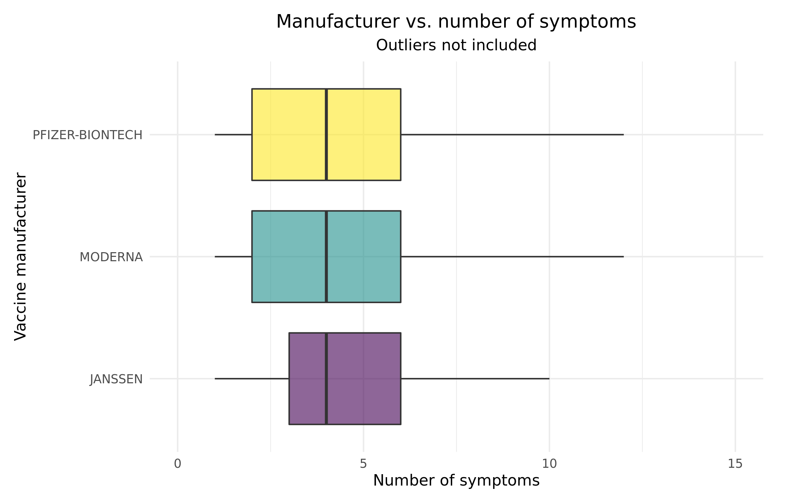
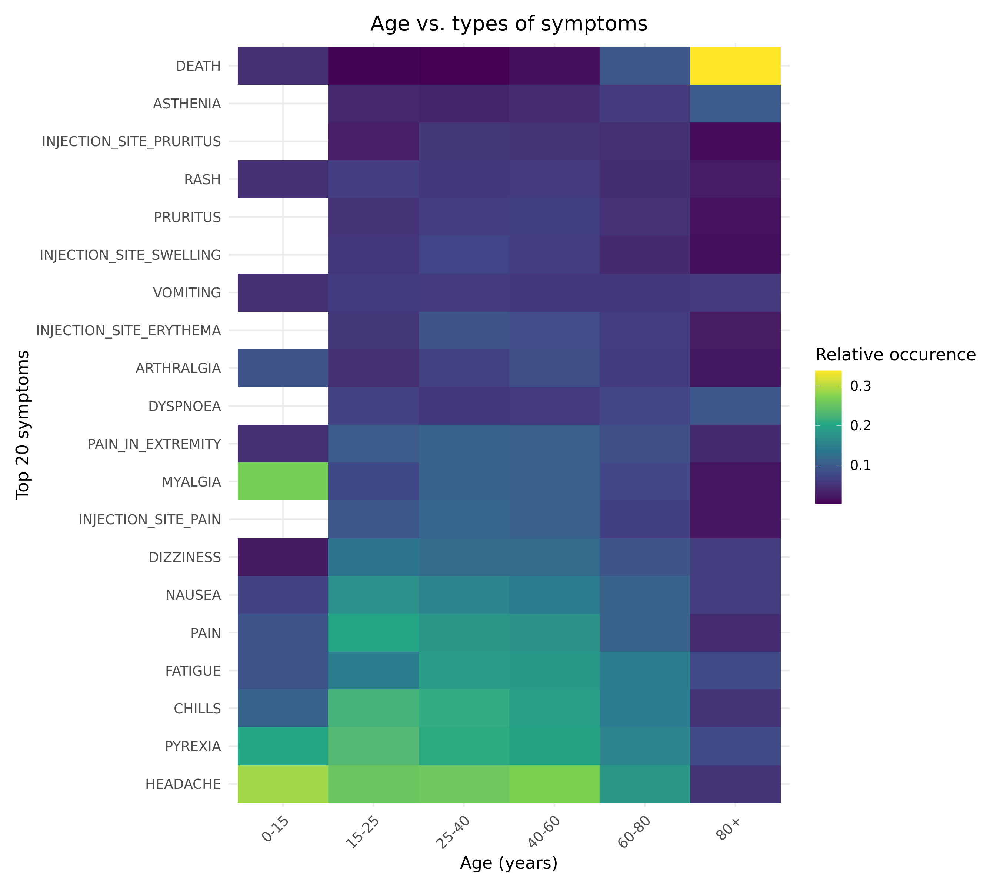
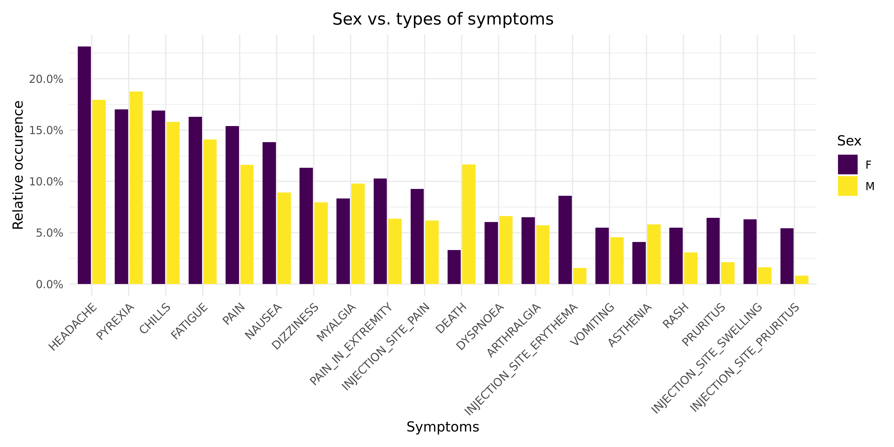
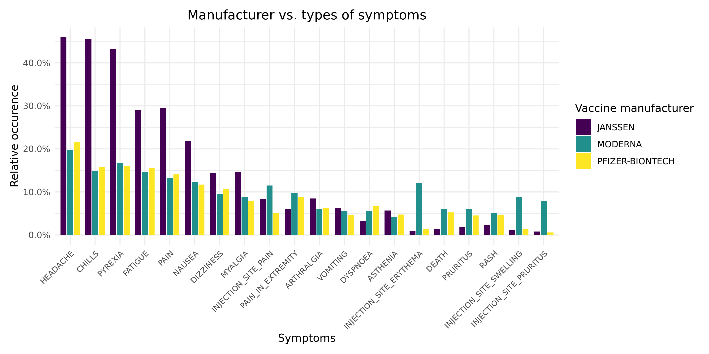
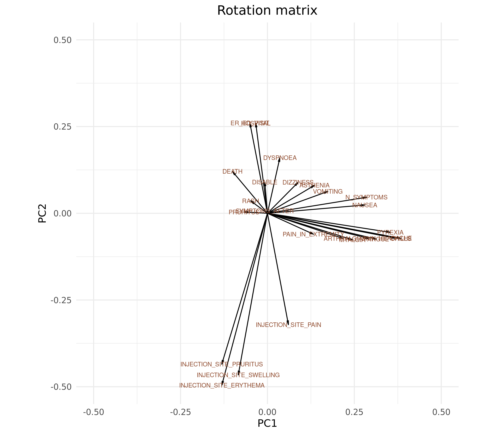

```{r setup, include=FALSE}
knitr::opts_chunk$set(echo = FALSE)
```

```{r include=FALSE}
library(tidyverse)
library(knitr)
```


## Overview of presentation
1. Introduction to COVID-19 World Vaccine Adverse Reactions Dataset
2. Project work flow
3. Project methods

    3.1 Overview of important packages and verbs used
    
    3.2 Challenges and solutions - Load, Clean and Augment
    
4. Visualizations
5. Modeling
6. Conclusion and discussion


# COVID-19 World Vaccine Adverse Reactions


## COVID-19 World Vaccine Adverse Reactions
- Found on Kaggle (https://www.kaggle.com/ayushggarg/covid19-vaccine-adverse-reactions?select=2021VAERSSYMPTOMS.csv)
- Data from the Vaccine Adverse Event Reporting System (VAERS) created by the Food and Drug Administration (FDA) and Centers for Disease Control and Prevention (CDC) 
- Contains 3 data sets: 
    1. PATIENTS.CSV
    2. VACCINES.CSV
    3. SYMPTOMS.CSV
- Data sets connected by individual IDs (VAERS_ID)
- VAERS User Guide (https://vaers.hhs.gov/docs/VAERSDataUseGuide_November2020.pdf)
  - A guide to variable names

```{r message=TRUE, warning=TRUE, include=FALSE}
patients <- read_csv(file = gzfile("../data/01_patients.csv.gz"), 
                     col_types = cols("BIRTH_DEFECT" = col_character(),
                                      "X_STAY" = col_character(),
                                      "RPT_DATE" = col_date(format="%Y-%m-%d"),
                                      "V_FUNDBY" = col_character(),
                                      "ER_VISIT" = col_character()))

symptoms <- read_csv(file = gzfile("../data/01_symptoms.csv.gz"))

vaccines <- read_csv(file = gzfile("../data/01_vaccines.csv.gz"),
                     col_types = cols("VAX_DOSE_SERIES" = col_character()))
```


## COVID-19 World Vaccine Adverse Reactions
**PATIENTS.CSV**: Contains information about the individuals that received the vaccines

```{r echo=FALSE}
head(patients, 3)
```

Dimensions:
```{r echo = TRUE}
dim(patients)
```


## COVID-19 World Vaccine Adverse Reactions
**VACCINES.CSV**: Contains information about the received vaccine

```{r echo=FALSE}
vaccines %>% head(., 3)
```

Dimensions:
```{r echo=TRUE}
dim(vaccines)
```


## COVID-19 World Vaccine Adverse Reactions
**SYMPTOMS.CSV**: Contains information about the symptoms experienced after vaccination

```{r echo=FALSE}
head(symptoms, 3)
```

Dimensions:
```{r echo=TRUE}
dim(symptoms)
```


## Project workflow

```{r workflow, echo = FALSE, out.width = "60%", out.extra = 'style = "float:right; padding:10px"'}

```

1. Load data sets (patients, vaccines, symptoms)
2. Clean each data set individually
3. Augment and merge the data sets
4. Make visualizations
5. Do modeling


## Project methods - Important packages and verbs
<style>
.column-left{
  float: left;
  width: 28%;
  text-align: left;
  margin: 0 4%;
}

.column-center{
  display: inline-block;
  width: 28%;
  text-align: left;
}
.column-right{
  float: right;
  width: 28%;
  text-align: left;
}
</style>


<div class="column-left">
### Load and clean

- **readr**: read_csv(), write_csv()
- **dyplyr**: filter(), select(), distinct(), mutate()
- **tidyr**: replace_na()
</div>


<div class="column-center">
### Augment

  - **dplyr**: filter(), select(), mutate(), case_when(), arrange(), group_by(), count(), distinct(), summarise(), drop_na(), rename()
  - **tidyr**: pivot_longer(), pivot_wider(), inner_join(), full_join(), pluck() 
  - **stringr**: regular expressions, str_c(), str_replace(), str_replace()
</div>


<div class="column-right">
### Visualizations and modeling

- **ggplot**: geom_bar(), geom_boxplot(), geom_tile(), geom_segment(), theme_minimal()
- **forcats**: fct_reorder()
- **scales**
- **patchwork**
- **viridis**
- **stats (?)**: glm(), prcomp()
- **broom**: tidy(), glance()
- **purrr**: map(), nest()
</div>


## Project methods - Challenges and solutions - 01_load 

### Patients, vaccines and symptoms data sets:

- Multiple **large files** &rightarrow; keep them compressed as **gz-files** and only decompress when reading into R
- Wrong **column types** automatically assigned by R &rightarrow; **manually assign** appropriate column types  
- **NA strings** ("NA", "N/A", "Unknown", " "...) &rightarrow; **assign NAs** when loading data


## 01_load - Challenges and Solutions 1 (DELETE SLIDE)

**CHALLENGE 1:** Multiple large files

**SOLUTION:** Keep them compressed and only decompress when reading into R:

```{r message=FALSE, warning=FALSE, include=TRUE, eval = FALSE}
# Read
patients <- read_csv(file = gzfile("../data/01_patients.csv.gz"))

# Clean
patients_clean <- patients %>% ...

# Write
write_csv(x = patients, file = "../data/02_patients_clean.csv.gz")
```


## 01_load - Challenges and Solutions 2 (DELETE SLIDE)

**CHALLENGE:** Wrong column types automatically assigned by R

```{r message=FALSE, warning=TRUE, include=TRUE}
patients <- read_csv(file = gzfile("../data/01_patients.csv.gz"))
```

**SOLUTION:** Manually assign column types

```{r message=FALSE, warning=FALSE, include=TRUE}
patients <- read_csv(file = gzfile("../data/01_patients.csv.gz"), 
                     col_types = cols("BIRTH_DEFECT" = col_character(),
                                      "X_STAY" = col_character(),
                                      "RPT_DATE" = col_date(format="%Y-%m-%d"),
                                      "V_FUNDBY" = col_character(),
                                      "ER_VISIT" = col_character()))
```


## 01_load - Challenges and Solutions 3 (DELETE SLIDE)

**CHALLENGE:** NA strings ("NA", "N/A", "Unknown", " "...)

**SOLUTION:** 

```{r message=FALSE, warning=FALSE, include=TRUE}
patients <- read_csv(file = gzfile("../data/01_patients.csv.gz"),
                     na = c("", " ", 
                                "NA", "N/A", "na", "Na", "n/a", "N/a", 
                                "None", "none", "None.", "NONE",
                                "unknown", "Unknown", "UNKNOWN", "U",
                                "NO KNOWN", "no known", "No known", "No Known", 
                                "None known", "none known", "NONE KNOWN", "None Known", 
                                "None reported", "Not applicable",
                                "No", "NO", "no"))
```


## Methods - Challenges and solutions - 02_clean

### Patients data set:

- Unwanted **dirty/uniformative columns** &rightarrow; **select(-c**(CAGE_YR, CAGE_MO, RPT_DATE,SYMPTOM_TEXT,LAB_DATA,OFC_VISIT, ER_VISIT, X_STAY,  V_FUNDBY, BIRTH_DEFECT,SPLTTYPE, RECVDATE, RECOVD, L_THREAT))
- **NAs** that should be interpreted as "no" &rightarrow; **replace_na()** 

  - Examples: ALLERGIES and OTHER_MEDS columns
  
- Row **duplications** &rightarrow; **distinct()**


## Methods - Challenges and solutions - 02_clean

### Vaccine data set:

- Contains **non-COVID19** vaccines &rightarrow; **filter**(VAX_TYPE == "COVID19")
- **Row duplications** &rightarrow; distinct() 
- **Duplicated IDs** &rightarrow; _add_count(VAERS_ID) %>% filter(n == 1) %>% select(-n)_
- Contains vaccines of **unknown manufacturer** &rightarrow; **filter**(VAX_MANU != "UNKNOWN MANUFACTURER")
- **Inconsistent naming** of vaccines &rightarrow; **recode()**
- **Redundant and dirty** columns &rightarrow; **select(-c(**VAX_NAME, VAX_LOT))

 

### Symptoms data set:

- SYMPTOMVERSION1-5 columns are **unneccessary** &rightarrow; **select(-c(**SYMPTOMVERSION1, SYMPTOMVERSION2, SYMPTOMVERSION3, SYMPTOMVERSION4, SYMPTOMVERSION5))


## 02_clean - Challenges and Solutions 1 (DELETE SLIDE)

I am aware of how horrible this table is :/


| CHALLENGE                                                        | SOLUTION                                              |
| ---------------------------------------------------------------- | ----------------------------------------------------- |
| Unwanted columns                                                 | `select(-c())`                                        |
| NAs that should be interpreted as "no"                           | `replace_na()`                                        |
| Row duplications                                                 | `distinct()`                                          |
| Individuals who got more than one vaccine type (generates noise) | `add_count(VAERS_ID) %>% filter(n==1) %>% select(-n)` |


## Project methods - Challenges and solutions - 03_augment 

### Patients data set:

- Columns containing **long string descriptions** &rightarrow; Make **tidy categorical variables** 
  - ALLERGIES &rightarrow; HAS_ALLERGIES (Y/N)
  - CUR_ILL &rightarrow; HAS_ILLNESS (Y/N)
  - CUR_ILL &rightarrow; HAS_COVID (Y/N)
  - HISTORY &rightarrow; HAD_COVID (Y/N)
  - PRIOR_VAX &rightarrow; PRIOR_ADVERSE (Y/N)
  - OTHER_MEDS &rightarrow; 
    - TAKES_ANTIINFLAMATORY (Y/N)
    - TAKES_STEROIDS (Y/N)
  - AGE_YEARS &rightarrow; AGE_CLASS 
  - DATEDIED, VAX_DATE &rightarrow; DIED_AFTER 
- **Uninformative** variable names &rightarrow; **mutate(), case_when()**
- Rows with **negative values** in DIED_AFTER &rightarrow; **filter()**
- **Dirty, redundant and uninformative** columns &rightarrow; **select(-c**(ALLERGIES, CURR_ILL, HISTORY, PRIOR_VAX, OTHER_MEDS, VAX_DATE, DATEDIED, ONSET_DATE, TODAYS_DATE))


## Project methods - Challenges and solutions - 03_augment 

### Vaccine data set:

- No augmentation!


### Symptoms data set:

- There are **too many symptoms** to analyze &rightarrow; make top_n_symptoms() function and use it to extract the **top 20 occurring symptoms**
- Symptoms are recorded in a way that makes **later analysis difficult** &rightarrow; turn top 20 symptoms into **TRUE/FALSE columns**
- **Total number of symptoms** needed for later analysis &rightarrow; *mutate()* to add column (N_SYMPTOMS) with total number of symptoms for each subject


## Project methods - Challenges and solutions - 03_augment 

### Merged data sets:

- Clean and augmented **patients, vaccines and symptoms** data sets &rightarrow; inner_join() for one **wide format** tibble
- For certain types of analysis, we need the symptoms in a **long-format** &rightarrow; **pivot_longer()** to create:
  - SYMPTOM column: top 20 symptom names
  - SYMPTOM_VALUE column: TRUE/FALSE


## 03_augment - Challenges and Solutions 1 (DELETE SLIDE)
**CHALLENGE:** Some columns contain long string descriptions that need to be turned into something tidy

**SOLUTION:** Make categorical variable


## 03_augment - Challenges and Solutions 1 (DELETE SLIDE)
**Example:** ALLERGIES column:
``` {r message=TRUE, warning=FALSE, include=FALSE}
patients %>%
  select(VAERS_ID, ALLERGIES) %>%
  head(6)
```

Make categorical variable that states if patient has allergies or not:
``` {r message=FALSE, warning=FALSE, include=TRUE, eval = FALSE}
patients %>%
  mutate(HAS_ALLERGIES = case_when(grepl("^no.?$ | ^no | ^none | ^not | ^non", 
                                         ALLERGIES, 
                                         ignore.case = TRUE) ~ "N",
                                 is.na(ALLERGIES) ~ "N",
                                 TRUE ~ "Y"))
```

Clean categorical HAS_ALLERGIES column:
``` {r echo = FALSE}
patients %>%
  mutate(HAS_ALLERGIES = case_when(grepl("^no.?$|^no |^none|^not|^non", 
                                         ALLERGIES, 
                                         ignore.case = TRUE) ~ 'N',
                                 is.na(ALLERGIES) ~ 'N',
                                 TRUE ~ 'Y')) %>%
  select(VAERS_ID, ALLERGIES, HAS_ALLERGIES) %>%
  filter(VAERS_ID == '0916603' | 
           VAERS_ID == '0916660' |
           VAERS_ID == '0916604' | 
           VAERS_ID == '0916685' | 
           VAERS_ID == '0917437' )
```


## 03_augment - Challenges and Solutions 1 (DELETE SLIDE)
**Another example:** OTHER_MEDS column

Detect individuals that have taken anti-inflammatory or steroid drugs before vaccine (not recommended):

``` {r message=FALSE, warning=FALSE, include=TRUE, eval = FALSE}
patients %>%
  mutate(TAKES_ANTIINFLAMATORY = 
           case_when(grepl("ibuprofen | aspirin | celecoxib | diclofenac | diflunisal | etodolac | indomethacin", 
                           OTHER_MEDS, 
                           ignore.case = TRUE) ~ "Y",
                     TRUE ~ "N")) %>% 
  mutate(TAKES_STEROIDS = 
           case_when(grepl("steroid | betamethasone | prednisolone | dexamethasone | hydrocortisone", 
                           OTHER_MEDS, 
                           ignore.case = TRUE) ~ "Y",
                     TRUE ~ "N"))
```


Clean, categorial TAKES_ANTIINFLAMMATORY and TAKES_STEROID columns:
``` {r echo = FALSE}
patients %>%
  mutate(TAKES_ANTIINFLAMATORY = case_when(grepl("ibuprofen|aspirin|celecoxib|diclofenac|diflunisal|etodolac|indomethacin", 
                                                 OTHER_MEDS, 
                                                 ignore.case = TRUE) ~ 'Y',
                                           TRUE ~ 'N')) %>% 
  mutate(TAKES_STEROIDS = case_when(grepl("steroid|betamethasone|prednisone|dexamethasone|hydrocortisone", 
                                          OTHER_MEDS, 
                                          ignore.case = TRUE) ~ 'Y',
                                    TRUE ~ 'N')) %>%
  select(VAERS_ID, OTHER_MEDS, TAKES_ANTIINFLAMATORY, TAKES_STEROIDS) %>%
  filter(VAERS_ID == "0921732" | VAERS_ID == "0918421" | VAERS_ID == "0934539" | VAERS_ID == "0932980")
```


## 03_augment - Challenges and Solutions 2 (DELETE SLIDE)

**CHALLENGE:** Symptoms are recorded in a way that makes later analysis difficult

``` {r echo=FALSE}
symptoms %>%
  select(VAERS_ID, SYMPTOM1, SYMPTOM2, SYMPTOM3, SYMPTOM4, SYMPTOM5) %>%
  slice(20:24)
```

**SOLUTION:** 20 most common symptoms are found and turned into TRUE/FALSE columns

``` {r message=FALSE, warning=FALSE, echo=FALSE}
merged_data_wide <- read_csv(file = gzfile("../data/03_merged_data_wide.csv.gz"))
merged_data_wide %>%
  select(VAERS_ID, HEADACHE, PYREXIA, CHILLS, FATIGUE, PAIN, PAIN_IN_EXTREMITY, NAUSEA, DIZZINESS, MYALGIA, INJECTION_SITE_ERYTHEMA, INJECTION_SITE_PRURITUS, INJECTION_SITE_SWELLING, INJECTION_SITE_PAIN, ARTHRALGIA, DYSPNOEA, VOMITING, PRURITUS, DEATH, RASH, ASTHENIA) %>%
  head(3)
```


# 04_analysis_visualizations


## 04_analysis_visualizations - Age, sex and vaccine manufacturer distribution

## 04_analysis_visualizations - Age distribution

## 04_analysis_visualizations - Age manufacturer distribution


```{r age_dist, echo = FALSE, out.width = "600px", out.height= "450px"}
include_graphics("../results/age_dist.png")

```

## 04_analysis_visualizations - Sex and vaccine manufacturer distribution

Table: Sex distribution

|SEX |     n|
|:---|-----:|
|F   | 24070|
|M   |  8514|
|NA  |   828|

Table: Vaccine manufacturer distribution

|VAX_MANU        |     n|
|:---------------|-----:|
|JANSSEN         |  1106|
|MODERNA         | 16253|
|PFIZER-BIONTECH | 16053|

## 04_analysis_visualizations - Days until onset of symptoms vs. Age Group

Hypothesis: two peaks corresponding to the innate and acquired immune response

```{r symptoms_after_v_agegroup, echo = FALSE, out.width = "700px", out.height= "350px"}
include_graphics("../results/symptoms_after_dist_age.png")

```


## 04_analysis_visualizations - Age/sex vs. number of symptoms

```{r nsymptoms_age_sex, echo = FALSE, out.width = "800px", out.height= "350px"}
include_graphics("../results/nsymptoms_age_sex.png")
```


## 04_analysis_visualizations - Vaccine manufacturer vs. number of symptoms

```{r nsymptoms_v_manu, echo = FALSE, out.width = "650px", out.height= "400px"}

```


## 04_analysis_visualizations - Age vs. types of symptoms

```{r symptom_types_v_age, echo = FALSE, out.width = "550px", out.height= "450px"}

```


## 04_analysis_visualizations - Sex vs. types of symptoms

```{r symptom_types_v_sex, echo = FALSE, out.width = "750px", out.height= "400px"}

```


## 04_analysis_visualizations - Vaccine manufacturer vs. types of symptoms

```{r symptom_types_v_manu, echo = FALSE, out.width = "875px", out.height= "455px"}

```


# 04_analysis_regressions


## 04_analysis_modeling | Logistic regression: death ~ patient profile

```{r, eval = FALSE}
merged_data_wide %>%
  glm(formula = DIED ~ SEX + AGE_YRS + HAS_ALLERGIES + HAS_ILLNESS + HAS_COVID + HAD_COVID, 
      family = binomial) %>%
  tidy() %>%
  mutate(odds_ratio = exp(estimate))
```


```{r death_v_profile_model, eval=TRUE, echo=FALSE, error=FALSE, message=FALSE, warning=FALSE, tidy = TRUE}
model <- read_csv("../results/death_v_profile_model.csv")
model
```

## 04_analysis_modeling | Logistic regression: death ~ patient profile

```{r death_v_profile_pval, echo = FALSE, out.width="50%", fig.show='hold'}
include_graphics(c("../results/death_v_profile_model_fig_pval.png", "../results/death_v_profile_model_fig_odds.png"))
```


## 04_analysis_modeling | Logistic regression: death ~ symptoms

```{r, eval = FALSE}
merged_data_wide %>%
  glm(formula = str_c("DEATH ~ ", str_c(symptoms, collapse = "+")), 
      family = binomial) %>%
  tidy() %>%
  mutate(odds_ratio = exp(estimate))
```


```{r death_v_symptoms_model, eval=TRUE, echo=FALSE, error=FALSE, message=FALSE, warning=FALSE, tidy = TRUE}
model <- read_csv("../results/death_v_symptoms_model.csv")
model %>%
  print(n = 8)
```


## 04_analysis_modeling | Logistic regression: death ~ symptoms

```{r, echo = FALSE, out.width = "60%", out.extra = 'style = "float:right; padding:10px"'}
include_graphics(c("../results/death_v_symptoms_model_fig_pval.png", "../results/death_v_symptoms_model_fig_odds.png"))
```


## 04_analysis_modeling | Many logistic regressions: each symptom ~ takes anti-inflamatory

```{r, eval = FALSE}
merged_data_long %>%
  select(TAKES_ANTIINFLAMATORY, SYMPTOM, SYMPTOM_VALUE) %>%
  group_by(SYMPTOM) %>%
  nest %>% 
  ungroup %>%
  mutate(mdl = map(data, ~glm(TAKES_ANTIINFLAMATORY ~ SYMPTOM_VALUE,
                              family = binomial))) %>%
  mutate(mdl_tidy = map(mdl, ~tidy(.x, conf.int = TRUE)))
```


```{r symptoms_v_antiinfl_model, eval=TRUE, echo=FALSE, error=FALSE, message=FALSE, warning=FALSE}
model <- read_csv("../results/symptoms_v_antiinflamatory_model.csv")
model %>%
  select(-c(term, symptom_label, neg_log10_p)) %>%
  print(n = 5)
```


## 04_analysis_modeling | Many logistic regressions: each symptom ~ takes anti-inflamatory

```{r symptoms_v_antiinfl_manhattan, echo = FALSE, out.width="50%", fig.show='hold'}
include_graphics(c("../results/symptoms_v_antiinflamatory_model_fig_manhattan.png", "../results/symptoms_v_antiinflamatory_model_fig_odds.png"))
```


# 04_analysis_tests 

## 04_analysis_tests
Chi-squared contingency table tests

```{r}
contingency_table1 <- read_csv("..\results\")
```


```{r eval=FALSE, include=FALSE, results='asis'}
    # Setting `results = 'asis'` allows for using Latex within the code chunk
    cat('\\begin{center}')
    # `{c c}` Creates a two column table
    # Use `{c | c}` if you'd like a line between the tables
    cat('\\begin{tabular}{ c c }')
    print(knitr::kable(contingency_table1, format = 'latex'))
    # Separate the two columns with an `&`
    cat('&')
    print(knitr::kable(contingency_table2, format = 'latex'))
    cat('\\end{tabular}')
    cat('\\end{center}')
```


```{r, echo = FALSE, out.width = "60%", out.extra = 'style = "float:right; padding:10px"'}
include_graphics(c("../results/manu_v_death.png", "../results/sex_v_death.png"))
```


# 04_analysis_clustering

## 04_analysis_clustering - Important tools used
Important verbs and tools used:

- prcomp()
- kmeans()
- tidymodels: (used for what?)


## 04_analysis_clustering - PCA biplot

```{r biplot, echo = FALSE, out.width = "695px", out.height= "400px"}
include_graphics("../results/biplot.png")
```

## 04_analysis_clustering - Rotation matrix

```{r rotation_matrix, echo = FALSE, out.width = "640px", out.height= "500px"}

```

## 04_analysis_clustering - Scree plot

```{r scree_plot, echo = FALSE, out.width = "695px", out.height= "340px"}
include_graphics("../results/scree_plot.png")
```


## Conclusion and discussion


